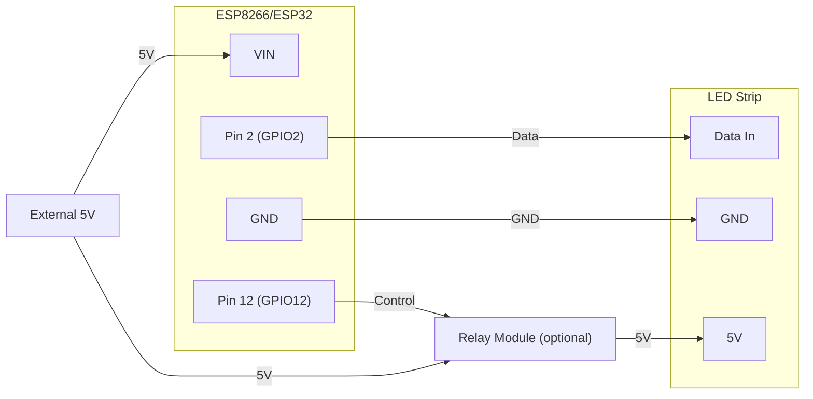

# 🐠 DeepGlow - Standalone Aquarium LED Controller


A complete standalone aquarium lighting controller system for ESP32/ESP8266 microcontrollers that provides **fish-safe** LED control with automated scheduling, custom aquarium effects, and a modern web interface.

## 🌟 Key Features

### Fish-Safe Operation System
- **Minimum transition times** - Gradual brightness changes protect fish eyes
- **Maximum brightness cap** - Prevents shocking fish with sudden bright light
- **Smooth interpolation** - All changes use exponential easing
- **Safety enforcement** - Multiple layers of protection at API, preset, and effect levels

### Preset Effects (WS2812FX Native)
All effects are now native WS2812FX effects, selected by their effect index. The default presets use the following WS2812FX effect indices:

| Preset Name        | Effect Index | WS2812FX Effect Name      |
|--------------------|--------------|--------------------------|
| Morning Sun        | 15           | FADE                     |
| Daylight           | 0            | STATIC                   |
| Afternoon Ripple   | 12           | RAINBOW_CYCLE            |
| Gentle Wave        | 3            | COLOR_WIPE               |
| Coral Shimmer      | 21           | TWINKLE_FADE             |
| Deep Ocean         | 37           | CHASE_BLUE               |
| Moonlight          | 2            | BREATH                   |

See the WS2812FX documentation for the full list of effect indices and names.

### Advanced Scheduling
- **NTP time synchronization** - Accurate timekeeping
- **Sunrise/sunset calculation** - Based on GPS coordinates
- **8 regular timers + 2 sun-based timers** - Flexible scheduling
- **Boot recovery** - Automatically applies correct preset after power loss
- **Day-of-week selection** - Different schedules for each day

### Modern Web Interface
- Responsive design (mobile & desktop)
- Real-time WebSocket updates
- Visual preset management (presets use WS2812FX effect indices)
- Schedule dashboard
- Configuration panel
- Ocean-themed gradient design

## 📋 Hardware Requirements

### Supported Microcontrollers
- **ESP32** (ESP32-WROOM, ESP32-DevKit)
- **ESP8266** (ESP-12E, ESP-01, NodeMCU)
- **ESP8285** (Athom 4-Pin Controller)
- **Memory**: 2MB-4MB flash recommended

### LED Support
- WS2812B (NeoPixel)
- SK6812 (RGBW)
- APA102 (DotStar)
- Up to 512 LEDs

### Minimum Requirements
- ESP8266/ESP32 board
- Addressable LED strip
- 5V power supply (sufficient for LED count)
- WiFi network (or use AP mode)

## 🔌 Wiring Diagram


### Basic Setup (ESP8266/ESP32)



**Legend:**
- Pin 2 (GPIO2) is the default data pin for both ESP8266 and ESP32.
- Both 5V and VIN must be connected to the external 5V supply for reliable operation. VIN is required.

**Important Notes:**
- Use a level shifter (74HCT245) for best reliability
- Add 470Ω resistor between MCU and LED data line
- Add 1000µF capacitor across LED power supply
- Ensure sufficient power supply (60mA per LED at full white)

## 🚀 Quick Start

### 1. Install PlatformIO

**VS Code:**
1. Install [VS Code](https://code.visualstudio.com/)
2. Install PlatformIO IDE extension
3. Restart VS Code

**Command Line:**
```bash
pip install platformio
```

### 2. Clone and Build

```bash
# Clone repository
git clone <your-repo-url>
cd DeepGlow

# Build for your board
pio run -e esp8266    # For ESP8266
pio run -e esp32      # For ESP32
pio run -e athom      # For Athom controllers
```

pio run -t uploadfs -e esp8266
### 3. Upload Filesystem (Web Interface)

```bash
# Upload filesystem (contains web interface)
pio run -t uploadfs -e esp8266
```

**Note:** PlatformIO's uploadfs/buildfs does not erase old files due to custom partitions. Old files (like presets.json) will persist unless deleted by firmware or a manual tool.

### 4. Upload Firmware

```bash
# Upload firmware
pio run -t upload -e esp8266

# Monitor serial output
pio device monitor
```

### 5. Initial Setup

1. **Power on** the device
2. **Connect to WiFi AP** named "AquariumLED" (password: `aquarium123`)
3. **Open browser** to `192.168.4.1`
4. **Configure WiFi** in the Configuration section
5. **Set your timezone and location** for sun calculations
6. **Enjoy!**

## ⚙️ Configuration

### WiFi Configuration

#### Method 1: Web Interface (AP Mode)
1. Device creates AP on first boot
2. Connect to "AquariumLED"
3. Configure WiFi credentials in web interface

#### Method 2: Edit config.json
```json
{
  "network": {
    "ssid": "YourWiFiName",
    "password": "YourPassword",
    "hostname": "AquariumLED"
  }
}
```

### LED Configuration

Edit in web interface or modify `config.json`:
```json
{
  "led": {
    "pin": 2,
    "count": 60,
    "type": "WS2812B",
    "colorOrder": "GRB"
  }
}
```

### Safety Settings

**Recommended for fish safety:**
- **Max Brightness**: 200/255 (78%)
- **Min Transition**: 5 seconds
- **Sunrise simulation**: 30+ minutes

```json
{
  "safety": {
    "maxBrightness": 200,
    "minTransitionTime": 5000
  }
}
```

### Location Settings (for Sunrise/Sunset)

Find your coordinates: [LatLong.net](https://www.latlong.net/)

```json
{
  "time": {
    "ntpServer": "pool.ntp.org",
    "timezoneOffset": -5,
    "latitude": 40.7128,
    "longitude": -74.0060,
    "dstEnabled": true
  }
}
```

## 📅 Creating Schedules

### Regular Timer
```json
{
  "enabled": true,
  "type": 0,
  "hour": 8,
  "minute": 0,
  "days": 127,
  "presetId": 0
}
```
- `days`: Binary flags (127 = all days, 62 = weekdays)
- `type`: 0 = regular, 1 = sunrise, 2 = sunset

### Sunrise/Sunset Timer
```json
{
  "enabled": true,
  "type": 1,
  "offset": 30,
  "days": 127,
  "presetId": 0
}
```
- `offset`: Minutes after sunrise/sunset (+/-)

## 🎨 Creating and Managing Presets

Presets use WS2812FX effect indices and parameters. You can manage presets via the web interface or API.

### Via Web Interface
1. Navigate to Presets section
2. Click "Add Preset"
3. Select effect (by index), brightness, and colors
4. Save preset

### Via API
```bash
curl -X POST http://aquariumled.local/api/preset \
  -H "Content-Type: application/json" \
  -d '{
    "id": 7,
    "name": "My Custom Preset",
    "brightness": 150,
    "effect": 1,  // WS2812FX effect index
    "params": {
      "speed": 100,
      "intensity": 180,
      "color1": 0x0088FF,
      "color2": 0x00FFFF
    }
  }'
```

To change the default presets, edit the `setDefaultPresets()` function in `src/config.cpp`.

## 🔧 API Reference

### REST API Endpoints

#### Get State
```http
GET /api/state
```

**Response:**
```json
{
  "power": true,
  "brightness": 180,
  "effect": 1,
  "transitionTime": 5000,
  "currentPreset": 2,
  "time": "14:32:05",
  "sunrise": "06:23",
  "sunset": "18:45",
  "params": {
    "speed": 128,
    "intensity": 150,
    "color1": 65535,
    "color2": 16776960
  }
}
```

#### Set State
```http
POST /api/state
Content-Type: application/json

{
  "power": true,
  "brightness": 200,
  "effect": 2,
  "transitionTime": 10000,
  "params": {
    "speed": 150,
    "intensity": 200,
    "color1": 0xFF0000,
    "color2": 0x00FF00
  }
}
```

#### Get Presets
```http
GET /api/presets
```

#### Apply Preset
```http
POST /api/preset
Content-Type: application/json

{
  "id": 3,
  "apply": true
}
```

#### Get Configuration
```http
GET /api/config
```

#### Update Configuration
```http
POST /api/config
Content-Type: application/json

{
  "safety": {
    "maxBrightness": 180,
    "minTransitionTime": 8000
  },
  "time": {
    "latitude": 51.5074,
    "longitude": -0.1278
  }
}
```

#### Get Timers
```http
GET /api/timers
```

#### Update Timer
```http
POST /api/timer
Content-Type: application/json

{
  "id": 0,
  "enabled": true,
  "type": 1,
  "offset": 30,
  "days": 127,
  "presetId": 0
}
```

### WebSocket

Connect to `ws://[device-ip]/ws` for real-time updates.

Server broadcasts state changes every 2 seconds and on any change.

## 🐟 Fish Safety Best Practices

### Transition Times
- **Minimum**: 5 seconds (enforced)
- **Recommended**: 10-30 seconds for manual changes
- **Sunrise/sunset**: 30-60 minutes

### Brightness Levels
- **Daytime**: 180-200/255 (70-78%)
- **Evening**: 100-150/255 (40-60%)
- **Night/Moonlight**: 20-50/255 (8-20%)

### Effect Guidelines
- **Avoid**: Rapid flashing or strobing effects
- **Safe**: Slow waves, gentle ripples, gradual color changes
- **Best**: Sunrise simulation for morning, moonlight for night

### Acclimation Period
1. **Day 1-3**: Max brightness 100/255
2. **Day 4-7**: Max brightness 150/255
3. **Day 8+**: Full brightness 200/255

## 🛠️ Troubleshooting

### WiFi Connection Issues
- Check SSID and password
- Ensure 2.4GHz WiFi (not 5GHz)
- Try AP mode for initial configuration
- Check signal strength

### LEDs Not Working
- Verify wiring (data pin, GND, power)
- Check LED type in configuration
- Ensure sufficient power supply
- Try reducing LED count

### Time Not Syncing
- Check internet connection
- Verify NTP server accessible
- Try alternative NTP server
- Check timezone offset

### Filesystem & Preset Errors
- **Presets.json is now always deleted and regenerated on boot by firmware.**
- PlatformIO's uploadfs/buildfs does not erase old files due to custom partitions.
- If you want to preserve user presets, modify the firmware logic in `loadPresets()`.
- Re-upload filesystem: `pio run -t uploadfs`
- Check available flash memory

### Boot Loop
- Check serial monitor for errors
- Ensure power supply adequate
- Flash with `erase` first
- Check for corrupted configuration

## 📊 Performance

### Frame Rates
- **ESP8266**: ~40-50 FPS (60 LEDs)
- **ESP32**: ~60 FPS (300+ LEDs)

### Memory Usage
- **ESP8266**: ~30KB RAM, ~400KB flash
- **ESP32**: ~50KB RAM, ~500KB flash

### Power Consumption
- **ESP8266**: ~80mA (WiFi active)
- **ESP32**: ~120mA (WiFi active)
- **LEDs**: ~60mA per LED (full white)

## 🔄 OTA Updates

Over-the-air firmware updates supported:

```bash
# Upload via OTA
pio run -t upload --upload-port aquariumled.local
```

**Note**: Configuration preserved during OTA updates.

## 📁 Project Structure & Preset Logic

```
DeepGlow/
├── platformio.ini          # Build configuration
├── src/
│   ├── main.cpp           # Main application
│   ├── config.h/cpp       # Configuration management
│   ├── effects.h/cpp      # (Unused, all effects are WS2812FX native)
### Preset Regeneration Logic

On every boot, the firmware deletes and regenerates `presets.json` with the default presets defined in `src/config.cpp`. If you want to preserve user presets, you must change this logic in `Configuration::loadPresets()`.
│   ├── scheduler.h/cpp    # Time & scheduling
│   ├── transition.h/cpp   # Smooth transitions
│   └── webserver.h/cpp    # Web server & API
├── data/
│   ├── index.html         # Web interface
│   ├── style.css          # Styling
│   └── app.js             # JavaScript logic
└── README.md              # This file
```

## 🤝 Contributing

Contributions welcome! Please:
1. Fork the repository
2. Create feature branch
3. Test thoroughly (especially fish safety features)
4. Submit pull request

## 📝 License

MIT License - See LICENSE file for details

## ⚠️ Disclaimer

This project controls LED lighting for live aquarium animals. Always:
- Test changes in a safe environment first
- Monitor fish behavior during acclimation
- Maintain safety limits for gradual transitions
- Keep backup traditional lighting available

## 🙏 Acknowledgments

- FastLED library for LED control
- ESPAsyncWebServer for web interface
- ArduinoJson for JSON parsing
- The aquarium hobby community

## 📧 Support

- **Issues**: [GitHub Issues](https://github.com/yourusername/DeepGlow/issues)
- **Discussions**: [GitHub Discussions](https://github.com/yourusername/DeepGlow/discussions)
- **Email**: support@example.com

---

**Made with 💙 for healthy, happy fish** 🐠
