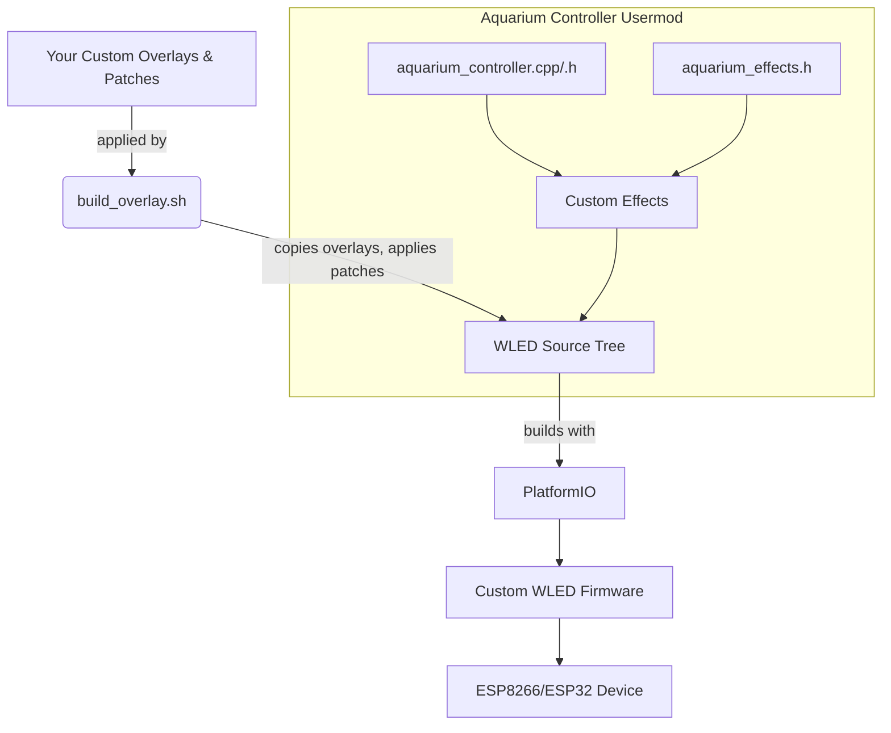
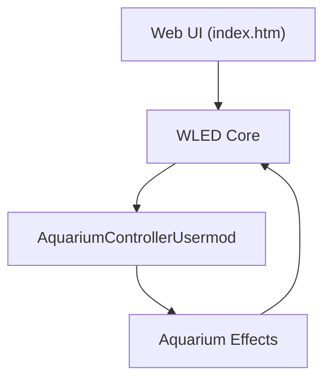

# AquariumWLED Overlay Project

AquariumWLED is an overlay system for [WLED](https://github.com/Aircoookie/WLED) that transforms it into a specialized aquarium lighting controller. It introduces:

- **Fish-safe operation**: Enforces minimum transition times and maximum brightness to protect aquatic life.
- **Automated daily scheduling**: Uses WLED's time-based presets and custom patches to automate lighting changes throughout the day.
- **Aquarium-specific LED effects**: Realistic underwater effects (ripple, gentle wave, sunrise, coral shimmer, deep ocean, moonlight).
- **Separation from WLED core**: All customizations are applied as overlays and patches, making it easy to update the WLED base without losing your changes.

---

## System Architecture

Below is a high-level diagram of how AquariumWLED overlays and patches integrate with the WLED firmware:


```mermaid
flowchart TD
      A[Your Custom Overlays & Patches] -->|applied by| B(build_overlay.sh)
      B -->|copies overlays, applies patches| C[WLED Source Tree]
      C -->|builds with| D[PlatformIO]
      D --> E[Custom WLED Firmware]
      E --> F[ESP8266/ESP32 Device]
      subgraph Aquarium Controller Usermod
         G[aquarium_controller.cpp/.h]
         H[aquarium_effects.h]
         G --> I[Custom Effects]
         H --> I
         I --> C
      end
```

**Legend:**
- Overlays: Custom usermod code, web UI, and configuration in `overlay/`
- Patches: `.patch` files in `patches/` for advanced modifications
- `build_overlay.sh`: Automates the process

---

---


## Key Features

- **Aquarium Controller Usermod**: Adds a usermod for WLED that enables:
   - Fish-safe minimum transition times and maximum brightness
   - Automated scheduling using WLED time presets
   - Custom aquarium-specific LED effects (ripple, gentle wave, sunrise, coral shimmer, deep ocean, moonlight)
- **Overlay System**: All custom code and configuration are applied as overlays or patches, keeping the WLED core untouched.
- **Automated Build Script**: `build_overlay.sh` handles repository setup, patching, overlay copying, and firmware build.

---

---


## Directory Structure

```text
overlay/
   usermods/
      aquarium_controller/
         aquarium_controller.cpp   # Usermod implementation and registration
         aquarium_controller.h     # Usermod class, config, and setup logic
         aquarium_effects.h        # Aquarium-specific LED effects
         library.json              # Metadata for the usermod
   wled00/
      data/
         index.htm                # Custom web UI for aquarium control
patches/
   01-apply_time_based_preset_on_boot.patch # Example patch for time-based presets
build_overlay.sh                # Main automation script
platformio.ini                  # Project config, copied as override for WLED
```

---


## How It Works

1. **Repository Management**:  
   The script clones or resets the WLED repository to ensure a clean base.
2. **Patching**:  
   Any `.patch` files in `patches/` are applied to the WLED source.
3. **Overlay Copy**:  
   All files in `overlay/` are copied into the WLED source tree, overwriting as needed.
4. **PlatformIO Configuration**:  
   `platformio.ini` is copied as `platformio_override.ini` into the WLED directory to enable the custom usermod and environment.
5. **Build**:  
   The script builds the firmware using PlatformIO for the specified environment (e.g., `Athom_4Pin_Controller`).

---

## Aquarium Controller Usermod: Internal Design


```mermaid
flowchart TD
   wledcore["WLED Core"] --> usermod["AquariumControllerUsermod"]
   usermod --> effects["Aquarium Effects"]
   effects --> wledcore
   webui["Web UI (index.htm)"] --> wledcore
```

**Highlights:**
- The usermod registers new effects and enforces safety (min transition, max brightness)
- Effects are implemented in `aquarium_effects.h` and selectable via the web UI
- The web UI (in `overlay/wled00/data/index.htm`) provides a modern interface for control and scheduling

---


## Aquarium Controller Usermod

- **Location**: `overlay/usermods/aquarium_controller/`
- **Key Files**:
   - `aquarium_controller.cpp` / `.h`: Registers the usermod, enforces safe transitions, and initializes effects.
   - `aquarium_effects.h`: Implements custom LED effects for aquarium environments.
   - `library.json`: Metadata for PlatformIO/library manager.

### Custom Effects

| Effect Name         | Description                                 |
|---------------------|---------------------------------------------|
| Aquarium Ripple     | Simulates water ripples                     |
| Gentle Wave         | Smooth flowing underwater waves              |
| Sunrise             | Gradual color shift from orange to blue      |
| Coral Shimmer       | Gentle twinkling for reef tanks              |
| Deep Ocean          | Slow, dark blue pulsing effect               |
| Moonlight           | Ultra-dim blue for nighttime                 |

---

---


## Usage

1. Run `./build_overlay.sh [platformio_args...]` to:
   - Prepare the WLED source
   - Apply patches and overlays
   - Build the firmware
   - Example: `./build_overlay.sh -e Athom_4Pin_Controller -t upload`
2. The resulting firmware will be in `WLED/build_output/release/`.
3. Flash the firmware to your ESP8266/ESP32 device as you would with standard WLED.

---

---


## Customization

- Add or modify overlays in `overlay/` to change WLED behavior.
- Add patch files to `patches/` for advanced modifications.
- Edit `platformio.ini` to change build environments or usermod settings.

---

---


## License

- The aquarium controller usermod and overlays: MIT License
- WLED: See [WLED repository](https://github.com/wled/WLED) for license details.
